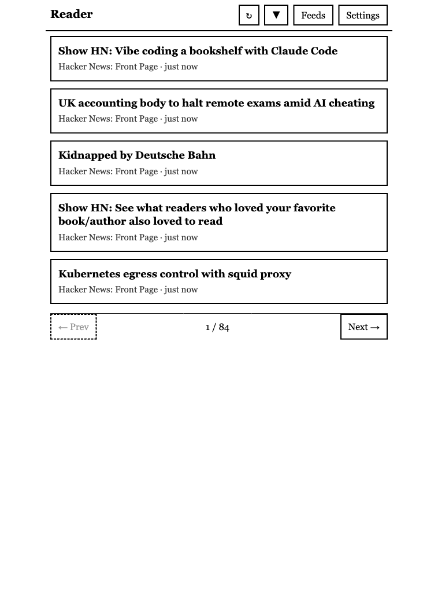
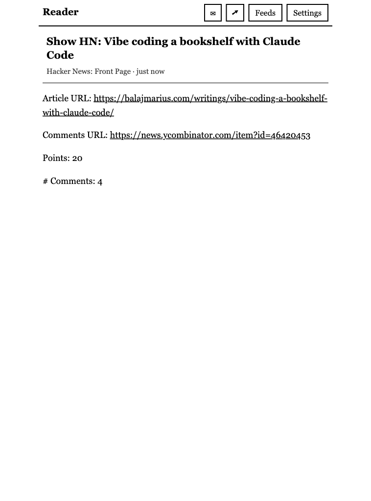
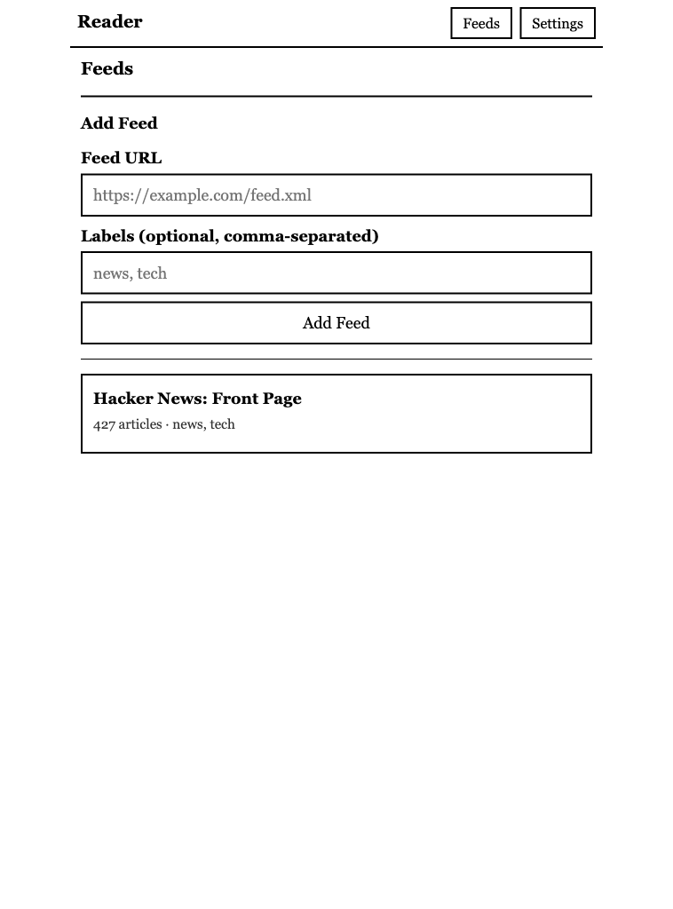
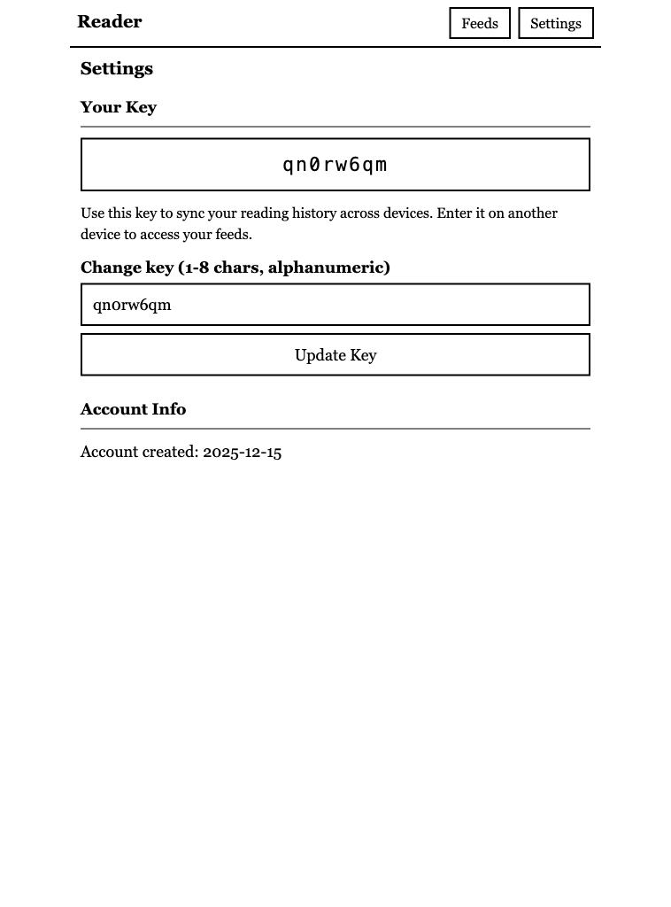

# E-Ink RSS Reader

A minimal, self-hosted RSS/Atom feed reader optimized for e-ink displays (Kindle web browser). Prioritizes readability, large touch targets, and pagination over scrolling.

## Screenshots

| Home | Article | Feeds | Settings |
|------|---------|-------|----------|
|  |  |  |  |

## Features

- **Feed Management**: Add/remove RSS and Atom feeds with multiple labels
- **Unified Feed View**: All articles sorted by publication date, paginated (no scrolling)
- **Reading History**: Track read/unread articles, toggle to hide read items
- **Label Filtering**: Organize feeds with labels and filter the article list
- **Cross-Device Sync**: Simple 8-character key syncs reading history between devices
- **Background Refresh**: Feeds auto-refresh every hour
- **Auto-Cleanup**: Articles older than 90 days are automatically removed
- **E-Ink Optimized**: High contrast, large buttons, no animations

## Quick Start

```bash
docker run -d -p 8000:8000 -v ./data:/app/data ghcr.io/alecrosenbaum/eink-reader:main
```

Open http://localhost:8000 in your browser. You'll be prompted to create or enter a user key.

Data is persisted in the `./data` directory on your host.

## Docker

```bash
# Pull from GitHub Container Registry
docker pull ghcr.io/alecrosenbaum/eink-reader:main

# Run with persistent data (bind mount)
docker run -d -p 8000:8000 -v ./data:/app/data ghcr.io/alecrosenbaum/eink-reader:main

# Or use a named volume
docker run -d -p 8000:8000 -v eink-data:/app/data ghcr.io/alecrosenbaum/eink-reader:main

# Or build locally
docker build -t eink-reader .
docker run -d -p 8000:8000 -v ./data:/app/data eink-reader
```

## Commands

```bash
# Install dependencies (including dev/test)
uv sync --extra dev

# Run the development server
uv run python run.py

# Run tests
uv run pytest

# Lint and format
uv run ruff check .
uv run ruff format .
```

## Configuration

Configuration can be set via environment variables or a `.env` file:

| Variable | Default | Description |
|----------|---------|-------------|
| `DATA_DIR` | `<project>/data` | Directory for database and other data files |
| `DEBUG` | `false` | Enable debug mode with auto-reload |
| `ARTICLES_PER_PAGE` | `5` | Number of articles per page |
| `ARTICLE_RETENTION_DAYS` | `90` | Days to keep articles before cleanup |
| `REFRESH_INTERVAL_SECONDS` | `3600` | Background refresh interval (1 hour) |

Example `.env` file:

```env
DATA_DIR=/var/lib/eink-reader
DEBUG=true
ARTICLES_PER_PAGE=10
```

## Project Structure

```
eink-reader/
├── app/
│   ├── main.py              # FastAPI app entry point
│   ├── config.py            # Settings (env vars)
│   ├── database.py          # SQLite connection & schema
│   ├── models.py            # Pydantic models
│   ├── services/
│   │   ├── crud.py          # Database operations
│   │   ├── feed.py          # Feed fetching/parsing
│   │   └── scheduler.py     # Background refresh jobs
│   ├── routers/
│   │   ├── pages.py         # HTML page routes
│   │   └── api.py           # JSON API routes
│   └── templates/           # Jinja2 HTML templates
├── static/
│   └── style.css            # E-ink optimized styles
├── data/                    # Database storage (gitignored)
├── tests/                   # pytest test suite
├── pyproject.toml           # Project dependencies
└── run.py                   # Server entry point
```

## Tech Stack

- **Backend**: FastAPI, Pydantic, feedparser
- **Database**: SQLite with aiosqlite
- **Templates**: Jinja2
- **Scheduling**: APScheduler
- **Package Manager**: uv
